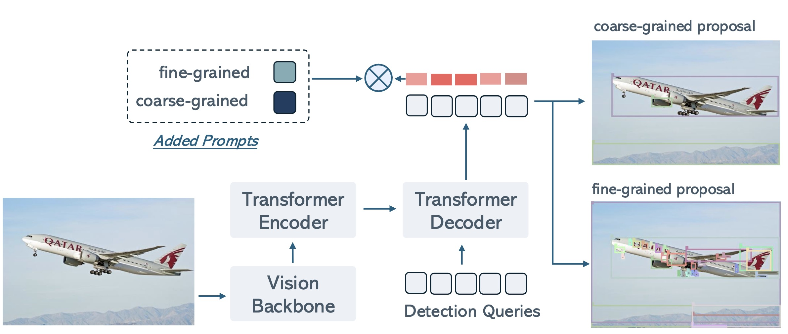

<div align=center>
  
</div>


<div align=center>

 [](https://arxiv.org/pdf/2403.14610.pdf)  [](https://hits.seeyoufarm.com)
</div>

# 1. Introduction 📚
**TL;DR: UPN is an object proposal model that can detect any object without any prompt input.**

Universal Proposal Network (UPN) is a robust object proposal model designed as part of ChatRex to enable comprehensive and accurate object detection across diverse granularities and domains. Built upon T-Rex2, UPN is a DETR-based model with a dual-granularity prompt tuning strategy, combining fine-grained (e.g., part-level) and coarse-grained (e.g., instance-level) detection.

<div align=center>
  
</div>

# 2. Installation 🛠️
```bash
conda install -n upn python=3.9
pip install torch==2.1.2 torchvision==0.16.2 --index-url https://download.pytorch.org/whl/cu121
pip install -v- e .
# install deformable attention
cd upn/ops
pip install -v -e .
```

To verify the installation, run the following command:
```bash
python tests/test_install.py
```

If the installation is successful, you will get two visualizations of the model's output in `tests` folder.


# 3. Usage 🚀
```python
import torch
from PIL import Image
from tools.visualize import plot_boxes_to_image
from upn import UPNWrapper

ckpt_path = "checkpoints/upn_large.pth"
test_image_path = "tests/test_image.jpeg"

model = UPNWrapper(ckpt_path)
# fine-grained prompt
fine_grained_proposals = model.inference(
    test_image_path, prompt_type="fine_grained_prompt"
)
fine_grained_filtered_proposals = model.filter(
    fine_grained_proposals, min_score=0.3, nms_value=0.8
)

# coarse-grained prompt
coarse_grained_proposals = model.inference(
    test_image_path, prompt_type="coarse_grained_prompt"
)
coarse_grained_filtered_proposals = model.filter(
    coarse_grained_proposals, min_score=0.3, nms_value=0.8
)
```

# BibTeX 📚
```
@misc{jiang2024trex2,
      title={T-Rex2: Towards Generic Object Detection via Text-Visual Prompt Synergy}, 
      author={Qing Jiang and Feng Li and Zhaoyang Zeng and Tianhe Ren and Shilong Liu and Lei Zhang},
      year={2024},
      eprint={2403.14610},
      archivePrefix={arXiv},
      primaryClass={cs.CV}
}
```
