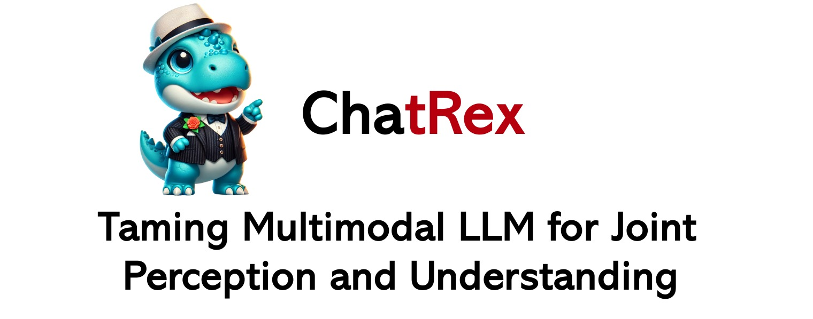
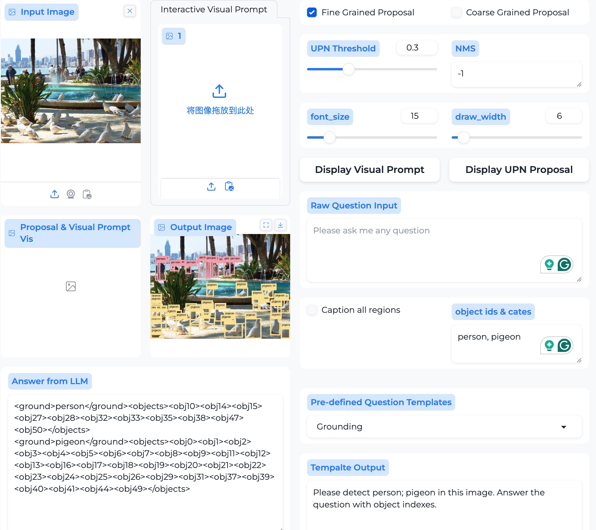

  

---

# ChatRex Demo: Visual Prompt Interaction Guide

  

Welcome to the ChatRex Demo! This tool demonstrates interactive visual prompt methods for AI-powered image understanding and question answering. This document provides detailed instructions on the workflow, interface components, and how to utilize the visual prompts effectively.

---

## **Workflow**

1. **Choose a Visual Prompt Method**  
   - Select either `Interactive Visual Prompt` or `Proposal Visual Prompt` to define your region of interest within the image.

2. **Provide a Question Input**  
   - Enter a valid question in the `Raw Question Input` field or use a `Pre-defined Question Template`. Ensure input accuracy to achieve relevant results.

3. **Run the Demo**  
   - Click on the `Run ChatRex` button to process the image and display the results, including answers and visualizations.

---

## **Visual Prompt Methods**

### 1. Interactive Visual Prompt
- **Overview**:  
  This mode allows you to manually annotate regions of interest by either:  
  - Clicking on the image to add a point, or  
  - Drawing a bounding box over specific areas.  

- **Display Visualization**:  
  Once the annotations are complete, click on `Display Visual Prompt` to visualize the selected regions.

- **Important Notes**:  
  - Ensure that **neither** `Fine Grained Proposal` nor `Coarse Grained Proposal` checkboxes are selected when using this mode.

---

### 2. Proposal Visual Prompt
- **Overview**:  
  This mode automatically generates bounding boxes based on the granularity of the proposal:
  - *Fine Grained Proposal*: Produces a detailed set of bounding boxes for smaller components (e.g., noses, eyes, or body parts).
  - *Coarse Grained Proposal*: Generates fewer bounding boxes for larger objects or overall entities (e.g., a person, dog, or full figure).

- **Display Visualization**:  
  Click `Display UPN Proposal` to view the generated bounding boxes.

---

## **Question Input Options**

### 1. Raw Question Input
- Enter your question in natural language. For example:  
  - *What objects are present in this image?*  
  - *What is the color of the dog's collar?*

### 2. Pre-defined Question Templates
- Select from a list of predefined templates to simplify the question input process.  
- If you need to specify object categories (e.g., *dog* or *cat*), enter their names or IDs in the `<Object ids & cates>` field, following the provided hints.

---

## **Tips and Support**

- If you're unsure how to interact with the application, refer to the tutorial video or browse the documented issues for additional guidance.
- For any further questions or feedback, feel free to contact us through the [Issues](https://huggingface.co/IDEA-Research/ChatRex-7B/issues) page.

---
