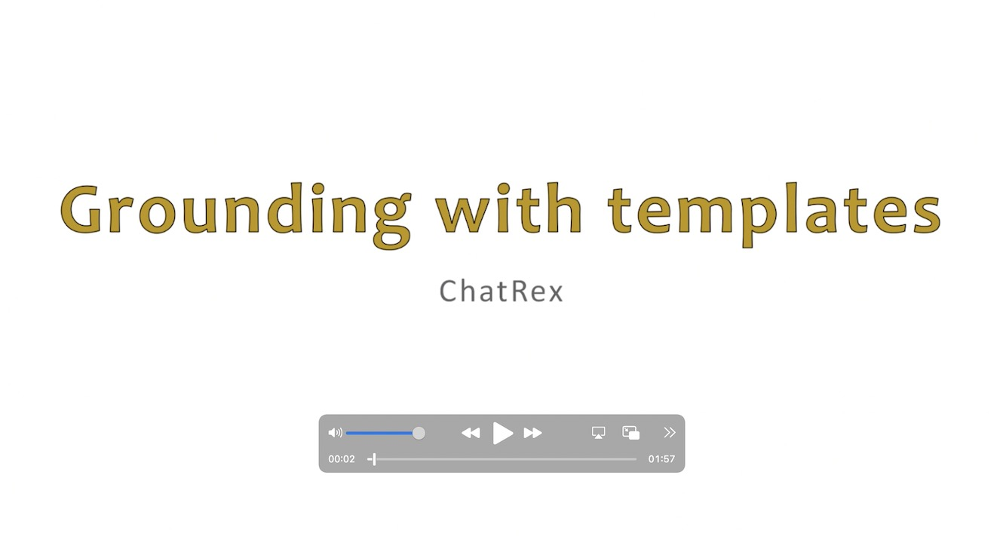

  

# ChatRex Demo: Visual Prompt Interaction Guide

   

---

# Contents
- [ChatRex Demo: Visual Prompt Interaction Guide](#chatrex-demo-visual-prompt-interaction-guide)
- [Contents](#contents)
- [1. Introduction 📖](#1-introduction-)
  - [1.1. Video Demo for ChatRex](#11-video-demo-for-chatrex)
- [2. Workflow 🚀](#2-workflow-)
  - [2.1. Visual Prompt Methods 🎤](#21-visual-prompt-methods-)
    - [2.1.1. Interactive Visual Prompt](#211-interactive-visual-prompt)
    - [2.1.2. Proposal Visual Prompt](#212-proposal-visual-prompt)
  - [2.2. Question Input ❓](#22-question-input-)
    - [2.2.1. Raw Question Input](#221-raw-question-input)
    - [2.2.2. Pre-defined Question Templates](#222-pre-defined-question-templates)
- [3. Tips and Support 💡](#3-tips-and-support-)

---
# 1. Introduction 📖

  

Welcome to the ChatRex Demo! This tool demonstrates interactive visual prompt methods for AI-powered image understanding and question answering. This document provides detailed instructions on the workflow, interface components, and how to utilize the visual prompts effectively.

## 1.1. Video Demo for ChatRex
We also provide a gradio demo for ChatRex. Before you use, we highly recommend you to watch the following video to understand how to use this demo:

---

# 2. Workflow 🚀

1. **Choose a Visual Prompt Method**  
   - Select either `Interactive Visual Prompt` or `Proposal Visual Prompt` to define your region of interest within the image.

2. **Provide a Question Input**  
   - Enter a valid question in the `Raw Question Input` field or use a `Pre-defined Question Template`. Ensure input accuracy to achieve relevant results.

3. **Run the Demo**  
   - Click on the `Run ChatRex` button to process the image and display the results, including answers and visualizations.

## 2.1. Visual Prompt Methods 🎤

### 2.1.1. Interactive Visual Prompt
- **Overview**:  
  This mode allows you to manually annotate regions of interest by either:  
  - Clicking on the image to add a point, or  
  - Drawing a bounding box over specific areas.  

- **Display Visualization**:  
  Once the annotations are complete, click on `Display Visual Prompt` to visualize the selected regions.

- **Important Notes**:  
  - Ensure that **neither** `Fine Grained Proposal` nor `Coarse Grained Proposal` checkboxes are selected when using this mode.

### 2.1.2. Proposal Visual Prompt
- **Overview**:  
  This mode automatically generates bounding boxes based on the granularity of the proposal:
  - *Fine Grained Proposal*: Produces a detailed set of bounding boxes for smaller components (e.g., noses, eyes, or body parts).
  - *Coarse Grained Proposal*: Generates fewer bounding boxes for larger objects or overall entities (e.g., a person, dog, or an whole entity).

- **Display Visualization**:  
  Click `Display UPN Proposal` to view the generated bounding boxes.

## 2.2. Question Input ❓

### 2.2.1. Raw Question Input
- Enter your question in natural language. For example:  
  - *What objects are present in this image?*  
  - *What is the color of the dog's collar?*
  - *Who painted the sculpture?*  

### 2.2.2. Pre-defined Question Templates
- Select from a list of predefined templates to simplify the question input process.  
- If you need to specify object categories (e.g., *dog* or *cat* -> `dog,cat`), enter their names or IDs in the `<Object ids>` field, following the provided hints.

---

# 3. Tips and Support 💡

- If you're unsure how to interact with the application, refer to the tutorial video or browse the solved issues for additional guidance.
- For any further questions or feedback, feel free to contact us through the [Issues](https://huggingface.co/IDEA-Research/ChatRex-7B/issues) page.

---
Enjoy exploring ChatRex's multimodal capabilities for seamless visual and language interaction!
